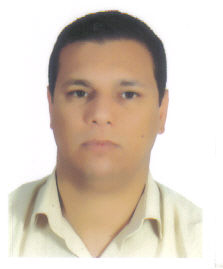

::: {.grid .align-items-center}

::: {.g-col-12 .g-col-md-4 .text-center}

{fig-alt="Portrait de Saîd MAHARI" .img-profile}

:::

::: {.g-col-12 .g-col-md-8}

## Saîd MAHARI

::: {.mb-3}

[Professeur agrégé]{.badge .bg-success .me-1} [MP — 2ᵉ année]{.badge .bg-primary .me-1} [+20 ans d'expérience]{.badge .bg-warning .text-dark}

:::

Professeur **agrégé de mathématiques**, j'enseigne depuis **plus de 21 ans** et j'ai acquis une solide expérience dans l'enseignement en classes préparatoires aux grandes écoles.

Je suis actuellement **enseignant de la classe MP (2ᵉ année)** à l'**École Royale Navale** (Casablanca).

Ce site regroupe l'ensemble de mes supports pédagogiques : cours, TD, annales de concours, ressources TIPE et conseils de méthode, destinés aux étudiants de CPGE.

::: {.callout .callout-note appearance="simple"}

### ✉️ Me contacter
📞 GSM : **06 70 05 06 67** — [Formulaire de contact](contact.qmd)

:::

:::

:::
